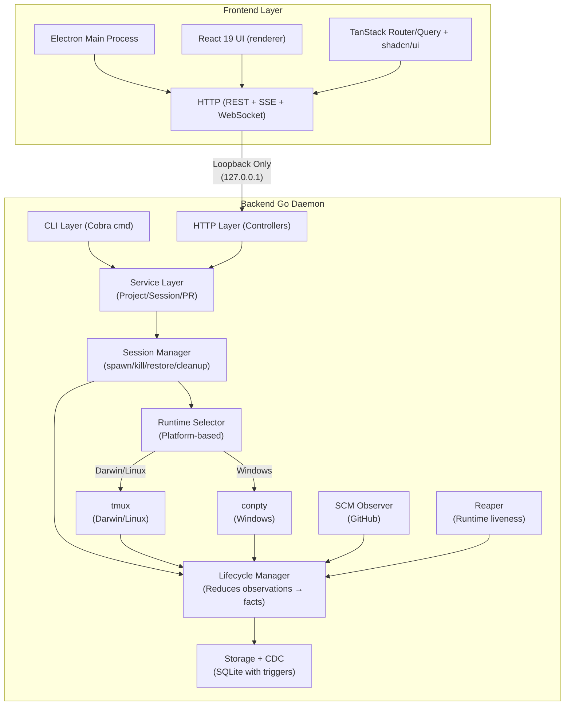
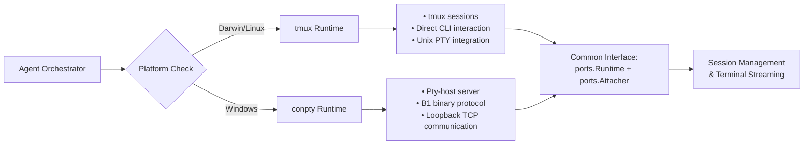
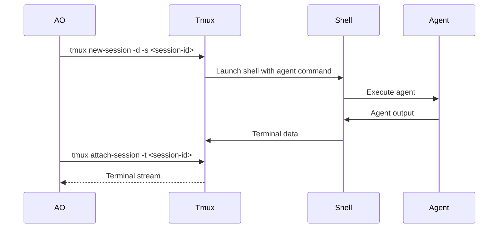
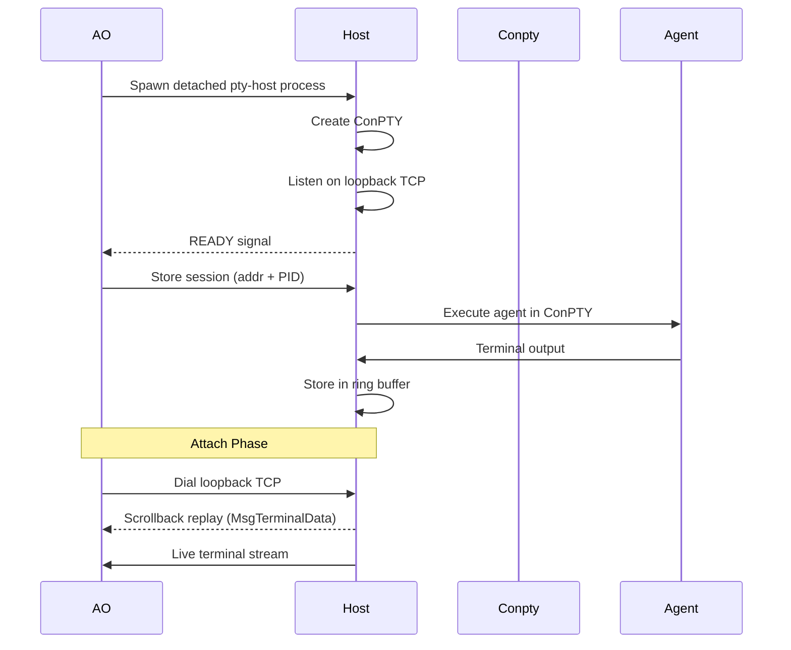
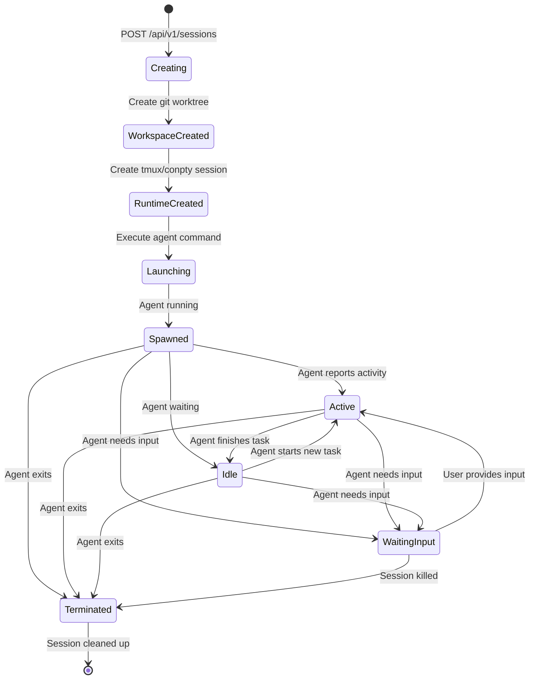
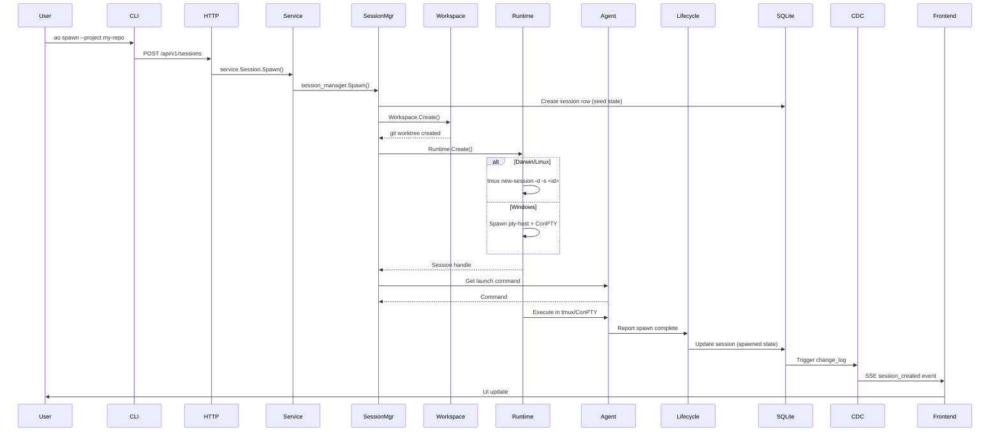
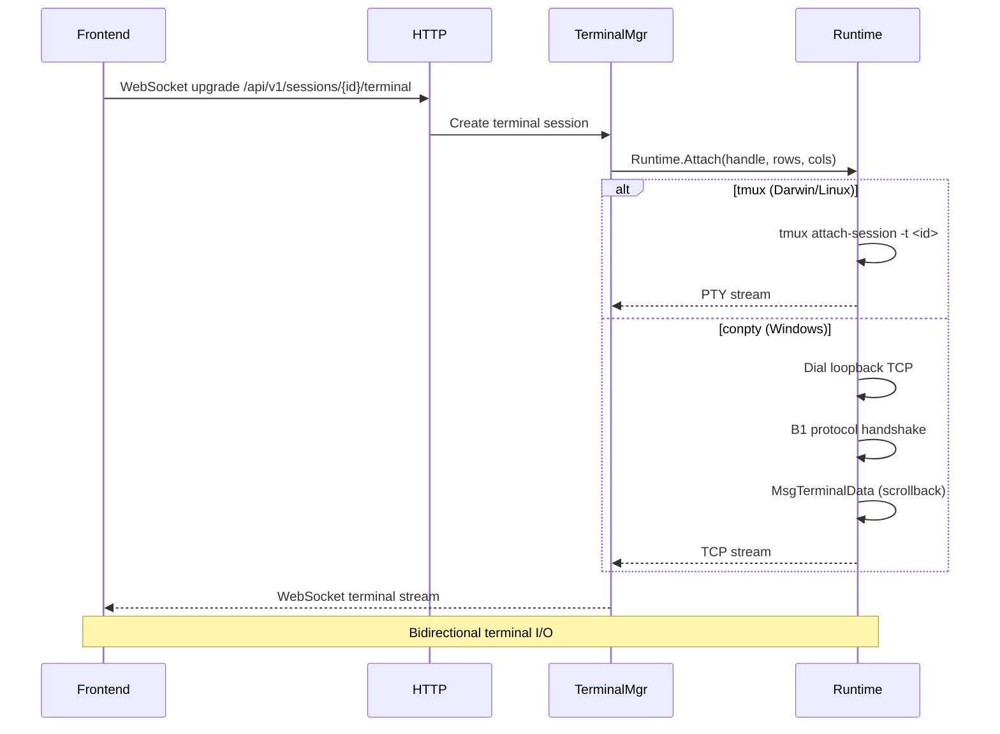
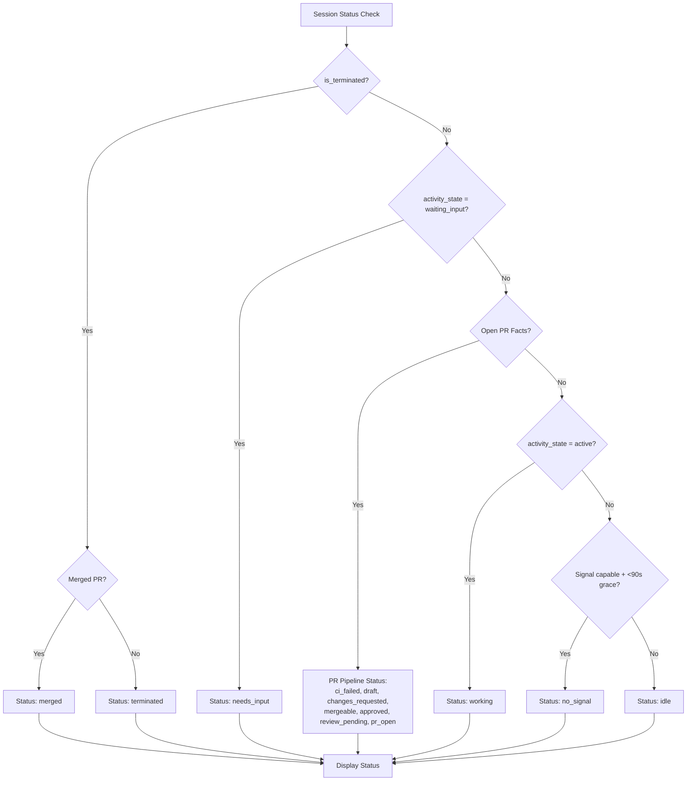
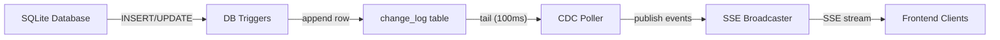

# Architecture

Agent Orchestrator is a long-running Go daemon that orchestrates parallel AI coding agents, each in an isolated `git worktree`, with automatic feedback routing from CI failures, review comments, and merge conflicts.

## Core Mental Model

```
OBSERVE external facts → UPDATE durable facts → DERIVE display status / ACT
```

The system stores only immutable facts (`activity_state`, `is_terminated`, PR facts) in SQLite. Display status is computed at read time — never stored.

The durable session facts are:

- **`activity_state`** — what the agent last reported or what the runtime observer can safely conclude (`active`, `idle`, `waiting_input`, `exited`)
- **`is_terminated`** — whether the session should be treated as over
- **PR facts** — in the `pr`, `pr_checks`, and `pr_comment` tables

The UI status is not stored. `service.Session` computes it from the session record plus PR facts while assembling controller-facing read models.

## Architecture Overview



## Runtime Architecture

### Platform-Specific Runtime Selection

The system uses a dual-runtime architecture optimized for each platform:



### Runtime Interface

Both tmux and conpty implement the same core interface:

```go
type Runtime interface {
    ports.Runtime      // Create, Destroy, IsAlive
    ports.Attacher     // Attach for terminal streaming
    SendMessage()       // Send input to session
    GetOutput()        // Get scrollback output
}
```

### tmux Runtime (Darwin/Linux)



**Key Features:**
- Creates detached tmux sessions with hidden status bar
- Direct tmux CLI interaction for session management
- `tmux send-keys` for input delivery
- `tmux capture-pane` for scrollback retrieval
- Sessions survive daemon restart (tmux persistence)

### conpty Runtime (Windows)



**Key Features:**
- Detached pty-host process with ConPTY
- Custom B1 binary protocol over loopback TCP
- Ring buffer for scrollback storage
- File-based registry for crash recovery
- Graceful shutdown with cleanup

## Package Layout

```
backend/internal/domain           shared vocabulary and API status value types
backend/internal/ports            inbound/outbound interfaces
backend/internal/service/{project,session,pr,review}
                                  controller-facing services and read-model assembly
backend/internal/session_manager  internal session command manager
backend/internal/lifecycle        runtime/activity/spawn/termination session fact reducer
backend/internal/observe/scm      SCM (GitHub) observer loop feeding PR facts
backend/internal/observe/reaper   runtime liveness observation loop
backend/internal/storage          SQLite persistence and DB-triggered CDC
backend/internal/cdc              change-log poller and broadcaster
backend/internal/httpd            daemon HTTP surface (REST + SSE + terminal mux)
backend/internal/terminal         WebSocket terminal multiplexer
backend/internal/adapters         agent/tmux+conpty runtime/git-worktree/GitHub SCM + tracker adapters
backend/internal/daemon           production wiring and shutdown
backend/internal/config           daemon env/default config
```

## Adapter Layer

Swappable implementations for each port:

| Port | Darwin/Linux | Windows | Purpose |
|------|--------------|---------|---------|
| **Runtime** | tmux | conpty | Terminal multiplexing and session isolation |
| **Workspace** | git worktree | git worktree | Isolated working directories |
| **Agent** | claude-code, codex, etc. | claude-code, codex, etc. | AI coding agent execution |
| **SCM** | GitHub | GitHub | Pull request observation |
| **Tracker** | GitHub | GitHub | Issue tracking |
| **Reviewer** | claude-code | claude-code | Code review execution |
| **Notifier** | desktop, slack, discord, webhook | desktop, slack, discord, webhook | Notification delivery |

## Session Lifecycle



## Data Flow: Spawn Session



## Data Flow: Terminal Streaming



## Status Derivation

`service.Session` selects the display PR from all PR snapshots for a session, then applies this precedence:



## Core Components

### Lifecycle Manager

`lifecycle.Manager` is the write path for session lifecycle facts:

- Runtime observations can mark a session terminated only when runtime and process are both clearly dead
- Activity signals update `activity_state`; `exited` also marks the session terminated
- PR observations trigger agent nudges for CI failures, review feedback, and merge conflicts

### Session Manager

`session_manager.Manager` performs internal session mutations:

| Operation | Description |
|-----------|-------------|
| **Spawn** | Create row → create workspace → create runtime → execute agent → report spawned |
| **Kill** | Mark terminated → destroy runtime → destroy workspace |
| **Restore** | Check terminated → restore workspace → create runtime → execute agent → report spawned |
| **Cleanup** | Reclaim terminated session workspaces |

### PR Manager

`pr.Manager` records SCM observations into the PR/check/comment tables:

- Persists PR state, CI results, review comments
- Forwards observations to lifecycle for agent nudges
- Merged PR marks owning session terminated

### Reaper

`observe/reaper` polls runtime liveness:

- Checks if tmux sessions still exist
- Checks if pty-host processes are alive
- Marks dead sessions terminated
- Cleans up leaked resources

## Persistence and CDC

SQLite is the durable store with CDC triggers:



**Tables:**
- `projects` — Registered repos with soft-delete
- `sessions` — Session facts (activity_state, is_terminated, runtime metadata)
- `pr` — PR facts (state, ci_state, review_decision, mergeability)
- `pr_checks` — CI run history
- `pr_comment` — Review comments
- `change_log` — CDC event log
- `notifications` — Dashboard notifications
- `review_runs` — Code review execution records
- `telemetry_events` — Telemetry storage

## Supported Agents (23+)

claude-code, codex, aider, cursor, opencode, cline, copilot, grok, droid, amp, agy, crush, qwen, goose, auggie, continue, devin, kimi, kiro, kilocode, vibe, pi, autohand

## Configuration

All configuration via environment variables:

| Variable | Default | Purpose |
|----------|---------|---------|
| `AO_PORT` | `3001` | HTTP bind port |
| `AO_REQUEST_TIMEOUT` | `60s` | Per-request timeout |
| `AO_SHUTDOWN_TIMEOUT` | `10s` | Graceful shutdown cap |
| `AO_RUN_FILE` | `~/.ao/running.json` | PID/port handshake |
| `AO_DATA_DIR` | `~/.ao/data` | SQLite data directory |
| `AO_AGENT` | `claude-code` | Compatibility agent |
| `GITHUB_TOKEN` | — | GitHub auth token |

**Runtime selection is automatic** based on platform — no configuration needed.

## Data Directory Structure

```
~/.ao/
├── running.json          # PID + port handshake
├── data/                 # SQLite state
│   ├── ao.db            # Main database
│   ├── ao.db-wal        # Write-ahead log
│   └── ao.db-shm        # Shared memory
└── electron/            # Electron userData (for desktop app)
```

## Load-bearing Rules

- Do not store display status
- Keep session status facts small: `activity_state`, `is_terminated`, and PR facts are the durable inputs
- Do not treat failed probes as death
- Do not force-delete registered dirty worktrees
- Runtime selection is platform-based, not configurable

## Related Documentation

- [Backend Code Structure](backend-code-structure.md) — Package-by-package ownership
- [AGENTS.md](../AGENTS.md) — Contributor and worker-agent contract
- [CLI Reference](cli/README.md) — Complete CLI command documentation
- [Telemetry](telemetry.md) — Telemetry policy and configuration
