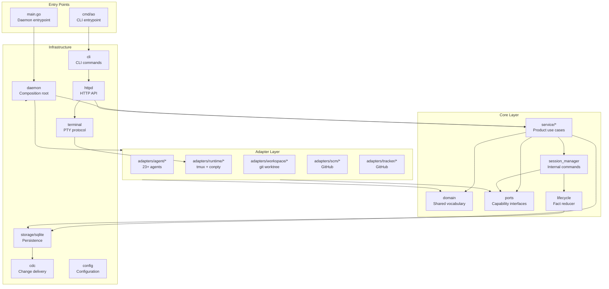
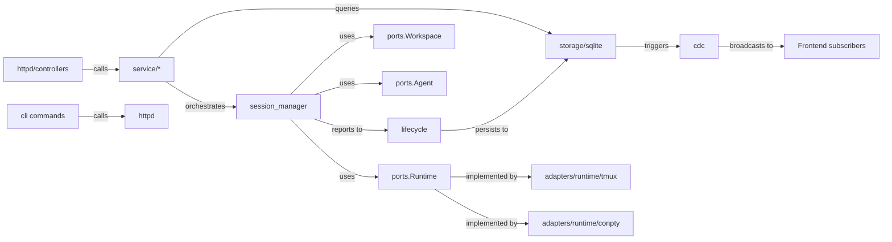
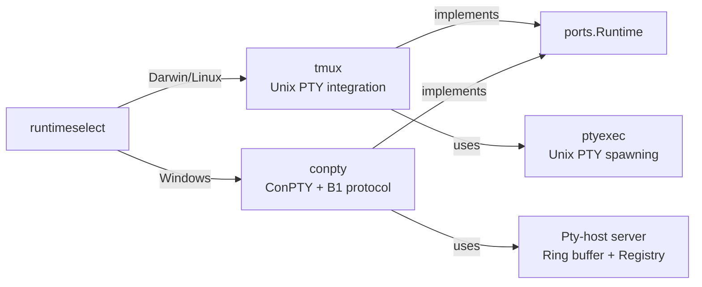
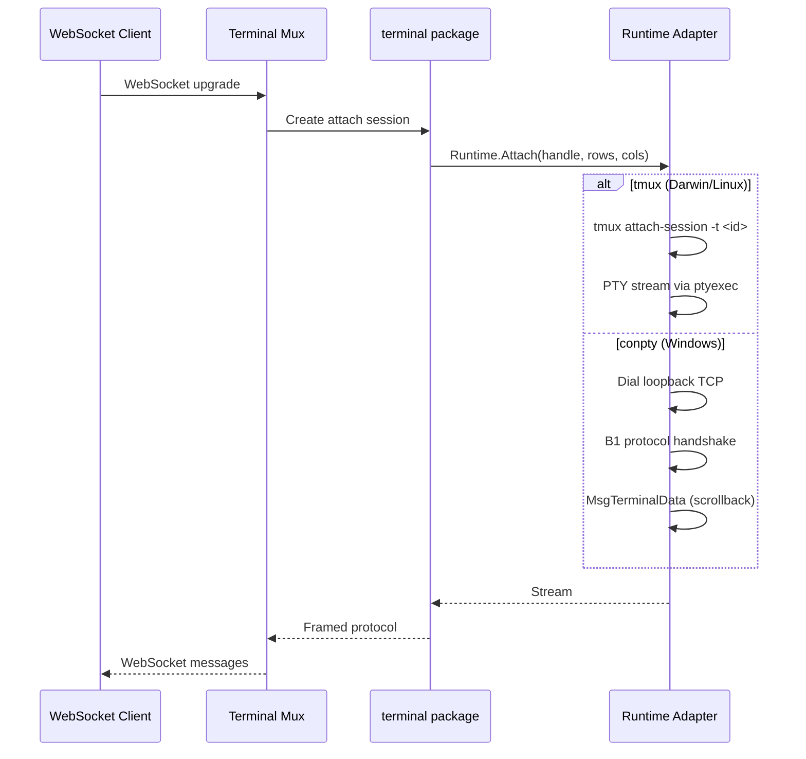
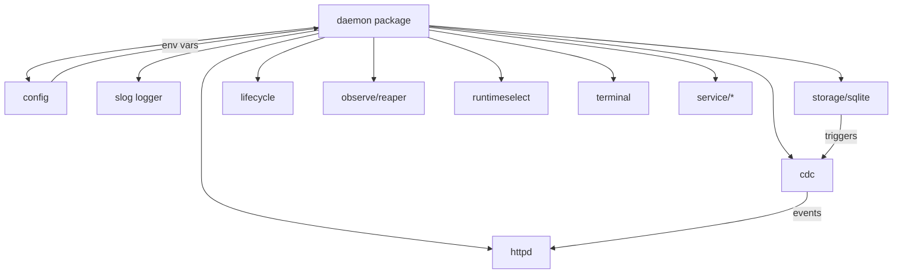
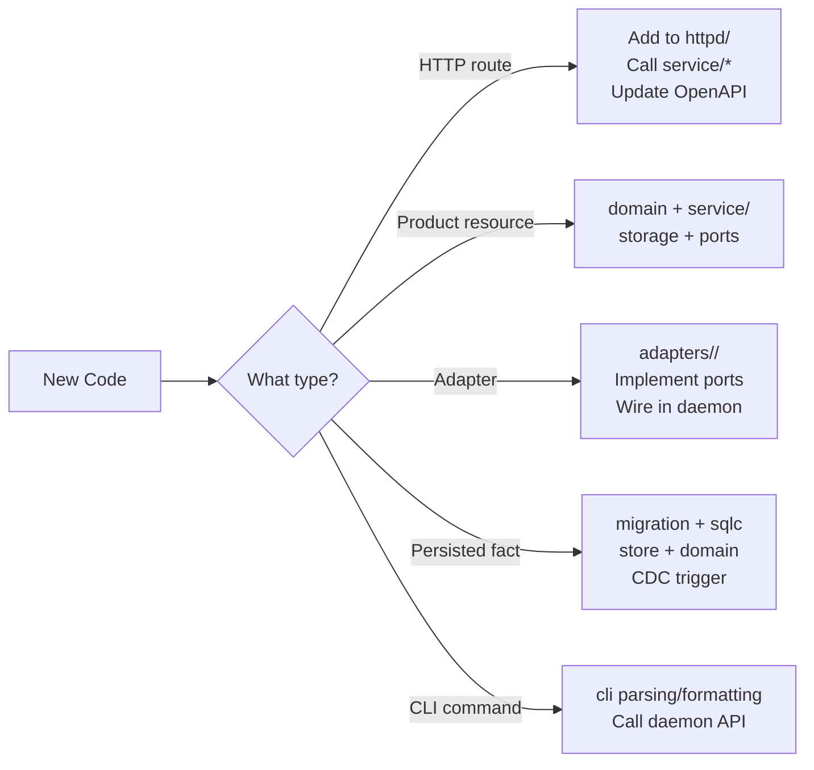
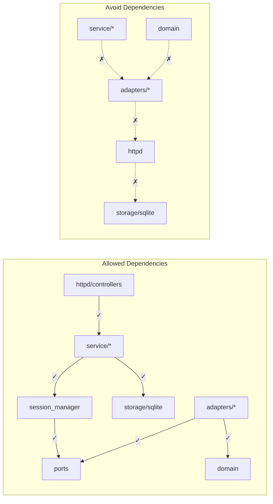

# Backend Code Structure

This document describes package ownership for the Go backend. It is about where code belongs. See [architecture.md](architecture.md) for lifecycle behavior, status derivation, persistence, CDC, and invariants.

## Goal

The backend is a local daemon that supervises coding-agent sessions. The code needs clear homes for product workflows, protocol surfaces, persistence, and replaceable external systems without turning any single package into a catch-all.

The current structure is a layered hybrid:

```
domain          → shared product vocabulary and durable fact records
service/*       → controller-facing product use cases and read models
session_manager → internal session mutations and resource orchestration
lifecycle       → durable session fact reducer
ports           → narrow capability interfaces consumed by core code
adapters/*      → implementations of those capabilities
storage/sqlite   → persistence and change delivery
httpd           → HTTP protocol concerns
cli             → CLI protocol concerns
daemon          → production composition root
```

## Package Architecture Overview



## Package Relationships



## Package Roles

### `internal/domain`

`domain` is AO's shared product language. Keep it stable and free of infrastructure imports.

**Belongs here:**
- Shared IDs: `ProjectID`, `SessionID`, `IssueID`
- Shared enums and status vocabulary
- Durable fact records that multiple packages must agree on
- PR, tracker, project, and session vocabulary (not transport-specific)

**Does not belong here:**
- HTTP request/response DTOs
- CLI output shapes
- OpenAPI wrapper/envelope types
- sqlc generated rows
- GitHub, tmux, Claude, Codex, or OpenCode payloads
- One-resource controller helper types

**Rule of thumb:** If AO would still use the concept after replacing HTTP, the CLI, SQLite, GitHub, the tmux/conpty runtime, and every agent adapter, and more than one package needs the exact vocabulary, it may belong in `domain`.

### `internal/service/*`

`service` packages are the controller-facing application boundary.

**Belongs here:**
- Resource use cases called by HTTP controllers and CLI-backed API flows
- Resource read models and command/result types
- Display-model assembly (session status derived from session and PR facts)
- Resource-specific validation and user-facing errors
- Small store interfaces consumed by the service

**Does not belong here:**
- Low-level runtime/workspace/agent process control
- Raw sqlc generated rows as public service results
- HTTP routing, path parsing, status-code decisions, or OpenAPI generation
- Concrete external adapter details

### `internal/session_manager`

`session_manager` owns internal session commands: spawn, restore, kill, cleanup, and send-related orchestration over runtime, workspace, agent, storage, messenger, and lifecycle dependencies.

**Belongs here:**
- Multi-step session mutations
- Rollback/cleanup sequencing when spawn partially succeeds
- Resource teardown safety
- Internal errors (not found, terminated, not restorable)

**Does not belong here:**
- HTTP request decoding
- CLI formatting
- Controller-facing list/get read-model assembly
- Terminal WebSocket framing

The split is intentional: `service/session` is the product/API boundary; `session_manager` is the internal command engine.

### `internal/lifecycle`

`lifecycle` is the canonical write path for durable session lifecycle facts. It reduces runtime observations, activity signals, spawn completion, termination, and PR observations into small persisted facts.

**Belongs here:**
- Updates to lifecycle-owned session facts
- Guardrails around runtime/activity observations
- Lifecycle-triggered agent nudges for actionable PR facts

**Does not belong here:**
- Display status persistence
- HTTP/CLI DTOs
- Direct adapter implementation details
- PR row persistence

### `internal/ports`

`ports` contains narrow capability interfaces and shared adapter-facing structs. It connects core code to replaceable systems.

**Capability interfaces:**
- `Runtime` — Create/Destroy/IsAlive for tmux/conpty sessions
- `Workspace` — Git worktree creation/destruction
- `Agent` — Agent launch, restore, hooks, session info
- `Attacher` — Terminal streaming attachment
- `PRWriter` — PR fact persistence
- `AgentResolver` — Agent binary resolution
- `AgentMessenger` — Message delivery to agents

**Belongs here:**
- Interfaces consumed by core packages and implemented by adapters
- Capability structs: `RuntimeConfig`, `WorkspaceConfig`, `SpawnConfig`
- Vocabulary needed at the boundary between core orchestration and adapters

**Does not belong here:**
- Resource read models (project/session API responses)
- HTTP request/response DTOs
- sqlc rows
- Concrete adapter options
- One-off interfaces that only a single package needs internally

### `internal/adapters/*`

Adapters are concrete implementations of external systems. They should be leaves in the import graph.

**Runtime Adapters:**



**Current adapters:**
```txt
internal/adapters/agent/claudecode
internal/adapters/agent/codex
internal/adapters/agent/opencode
internal/adapters/runtime/tmux          # Darwin/Linux
internal/adapters/runtime/conpty         # Windows
internal/adapters/runtime/runtimeselect  # Platform selector
internal/adapters/runtime/ptyexec        # PTY spawning
internal/adapters/workspace/gitworktree
internal/adapters/scm/github
internal/adapters/tracker/github
internal/adapters/reviewer/claudecode
```

**Good dependencies:**
```
session_manager → ports.Runtime
adapters/runtime/tmux → ports + domain
adapters/workspace/gitworktree → ports + domain
daemon → adapters + services + storage
```

**Avoid:**
```
domain → adapters
service/session → adapters/runtime/tmux
httpd/controllers → storage/sqlite/store
adapters/* → httpd
```

### `internal/storage/sqlite`

`storage/sqlite` owns SQLite setup, migrations, sqlc generated code, and store implementations.

**Belongs here:**
- Connection setup and PRAGMAs
- Goose migrations
- sqlc queries and generated code
- Table-specific store methods
- Transactions and CDC-triggered persistence behavior

**Does not belong here:**
- HTTP response types
- CLI output formatting
- Product display status rules
- External adapter logic

Generated sqlc types should stay behind store methods. Services and lifecycle code should work with domain records or service read models, not generated rows.

### `internal/cdc`

`cdc` owns `change_log` polling and event broadcasting. SQLite triggers append durable events to `change_log`; the poller tails that table and fans events out to subscribers.

**Belongs here:**
- Event type definitions for the CDC stream
- Poller and broadcaster logic
- Subscriber fan-out behavior

**Does not belong here:**
- Terminal byte streams
- Product workflow decisions
- Database schema ownership

### `internal/terminal`

`terminal` owns the terminal session protocol and PTY attach management used by the HTTP mux. The runtime is selected by `runtimeselect`: tmux on Darwin/Linux, conpty on Windows.



**Belongs here:**
- Per-client attachment lifecycle (liveness gating, re-attach backoff)
- Input/output framing independent of HTTP
- PTY-backed attach handling and terminal protocol tests

### `internal/httpd`

`httpd` is the HTTP protocol adapter.

**Belongs here:**
- Routing and middleware
- HTTP request decoding and response encoding
- Path/query parameter handling
- Status-code mapping
- API error envelopes
- OpenAPI generation and serving
- WebSocket upgrade handling for terminal mux

Controllers call service managers and translate service results/errors into HTTP responses. Controllers should not reach directly into concrete adapters or the SQLite store.

### `internal/cli`

`cli` owns the user-facing `ao` command. It should stay thin:

- Discover the local daemon
- Call the daemon's loopback HTTP API
- Format command output
- Start/stop/status/doctor process control

The CLI should not duplicate daemon business logic. If a command needs product behavior, put the behavior in the daemon service/API path and have the CLI call that path.

### `internal/daemon`

`daemon` is the production composition root. It wires config, logging, SQLite, CDC, lifecycle, reaper, runtime, terminal manager, services, HTTP, and shutdown.



**Belongs here:**
- Production dependency construction
- Adapter registration
- Startup/shutdown sequencing
- Cross-component wiring

**Does not belong here:**
- Business logic that should be testable in service, lifecycle, or manager packages
- Adapter implementation details

## Current Tree

```mermaid
graph TB
    Root["backend/"]
    
    Root --> Cmd["cmd/ao/<br/># CLI entrypoint"]
    Root --> Main["main.go<br/># Daemon entrypoint"]
    Root --> Sqlc["sqlc.yaml"]
    
    Root --> Domain["internal/domain/<br/># Shared vocabulary"]
    Root --> Ports["internal/ports/<br/># Capability interfaces"]
    
    Root --> Service["internal/service/"]
    Service --> Proj["project/<br/># Project API"]
    Service --> Sess["session/<br/># Session API"]
    Service --> PR["pr/<br/># PR service"]
    Service --> Review["review/<br/># Code review"]
    
    Root --> SessMgr["internal/session_manager/<br/># Internal commands"]
    Root --> Life["internal/lifecycle/<br/># Fact reducer"]
    
    Root --> Observe["internal/observe/"]
    Observe --> SCM["scm/<br/># GitHub observer"]
    Observe --> Reap["reaper/<br/># Liveness observer"]
    
    Root --> Store["internal/storage/sqlite/<br/># DB + stores"]
    Root --> CDC2["internal/cdc/<br/># Change delivery"]
    Root --> Term["internal/terminal/<br/># PTY protocol"]
    Root --> HTTPD2["internal/httpd/<br/># HTTP API"]
    Root --> CLI2["internal/cli/<br/># CLI commands"]
    Root --> Daemon2["internal/daemon/<br/># Composition"]
    Root --> Cfg["internal/config/<br/># Config"]
    
    Root --> Adapters["internal/adapters/"]
    Adapters --> Agent["agent/<br/># 23+ agents"]
    Adapters --> Runtime2["runtime/"]
    Runtime2 --> Tmux2["tmux<br/># Darwin/Linux"]
    Runtime2 --> Conpty2["conpty<br/># Windows"]
    Runtime2 --> RS["runtimeselect<br/># Selector"]
    Runtime2 --> PE["ptyexec<br/># PTY spawning"]
    Adapters --> WS["workspace/gitworktree"]
    Adapters --> SCM2["scm/github"]
    Adapters --> Track["tracker/github"]
    Adapters --> Rev["reviewer/claudecode"]
```



## Interface Placement

Prefer interfaces near their consumers, except for shared capabilities.

- **Single consumer:** Define the smallest interface in that package
- **Multiple core consumers:** Define it in `ports`
- **Resource service:** Use the owning `service/*` manager interface
- **Return types:** Return concrete types from constructors unless callers genuinely need an interface

## Adding New Code

Use these defaults:



## Project Routes Example

Project-owned concepts live in `internal/service/project`:

- Project read models
- Project add/remove command types
- Project validation and user-facing errors
- The `Manager` contract consumed by HTTP controllers

`internal/httpd/controllers` remains responsible for:
- Route registration
- JSON decoding/encoding
- HTTP status codes and error envelopes
- Mapping service errors to responses

## Dependency Rules



**Key rules:**
- Controllers call services, not storage directly
- Services call session manager, not adapters directly
- Adapters implement ports, don't depend on HTTP/storage
- Domain stays pure, no infrastructure dependencies
- Terminal and httpd are separate (terminal should not import httpd)

## Runtime Architecture Details

### Platform Selection

The `runtimeselect` package automatically chooses the appropriate runtime based on the platform:

```go
func New(_ *slog.Logger) Runtime {
    if runtime.GOOS != "windows" {
        return tmux.New(tmux.Options{})  // Darwin/Linux
    }
    return conpty.New(conpty.Options{})    // Windows
}
```

No configuration needed — the system handles this automatically.

### tmux Implementation (Darwin/Linux)

**File:** `internal/adapters/runtime/tmux/tmux.go`

- Creates detached tmux sessions
- Uses `tmux send-keys` for input delivery
- Uses `tmux capture-pane` for scrollback
- Spawns `tmux attach-session` for terminal streaming
- Sessions survive daemon restart (tmux persistence)

### conpty Implementation (Windows)

**Files:** `internal/adapters/runtime/conpty/*.go`

- Spawns detached pty-host process
- Uses custom B1 binary protocol over loopback TCP
- Implements ring buffer for scrollback
- File-based registry for crash recovery
- Direct TCP connection for terminal streaming (no CLI attach)

## Related Documentation

- [Architecture](architecture.md) — System architecture and data flows
- [AGENTS.md](../AGENTS.md) — Contributor and worker-agent contract
- [CLI Reference](cli/README.md) — Complete CLI command documentation
